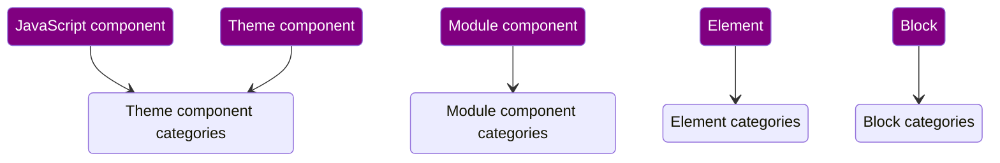

# Drupal Canvas Components

In the rest of this document, `Drupal Canvas` will be written as `Canvas`.

**Also see the [diagram](diagrams/data-model.md).**

## 1. Terminology

### 1.1 Existing Drupal Terminology that is crucial for Canvas

- `SDC`: a [Single-Directory Component](https://www.drupal.org/project/sdc)
- `Block`: a [block plugin](https://www.drupal.org/docs/drupal-apis/block-api/block-api-overview) — ⚠️ not to be confused with `Block` config entities

### 1.2 Canvas terminology

- `component`: a component generates markup (and might attach CSS + JS), potentially based on some input. ⚠️ This is currently limited to `SDC`s, but that _will_ change. So: read this more broadly. ⚠️
- `Component Source Plugin`: `component`s have a translation layer (per `component type`) between the `Component` config entity and the actual plugin that
  accepts input and generates output, e.g. `SingleDirectoryComponent` (`sdc`-prefixed) and `BlockComponent` (`block`-prefixed).
- `component input`: either `explicit component input` or `implicit component input`, this is the catch-all for both
- `component slot`: each component may in its metadata define 0 or more slots, each slot accepts >=0 component instances in a particular order
- `component type`: the ID of a `Component Source Plugin` — currently either "sdc", "block" or "js"
- `explicit component input`: each `component` may in its metadata define 0 or more explicit inputs to be provided by the person placing an instance of this `component`, each input accepts structured data conforming to the shape defined in the `component`'s (`ComponentSourcePlugin`-specific) metadata
- `implicit component input`: in contrast with a `explicit component input`, an implicit input is not provided by the person placing an instance: it is implicitly present: it is provided by other content displayed on the current route, by the request context (e.g. URL query string, current user …) or by the environment (e.g. time of day).
  - ⚠️This is not yet supported. the `Block` component type needs it to support [_contexts_](https://www.drupal.org/docs/drupal-apis/plugin-api/plugin-contexts#s-context-on-blocks), unclear how that will be surfaced in Canvas; initially, only block plugins that do not require contexts are supported.

## 2. Product requirements

This uses the terms defined above.

(There are [more](https://docs.google.com/spreadsheets/d/1OpETAzprh6DWjpTsZG55LWgldWV_D8jNe9AM73jNaZo/edit?gid=1721130122#gid=1721130122), but these in particular affect Canvas's supported components.)

- MUST be possible for the Site Builder to control, audit and synchronize which `component`s are available for Content Creators → see [`Canvas Config Management` doc](config-management.md)
- MUST support `SDC` and `Block` today
  - MUST be evolvable to [support other component types later](https://www.drupal.org/project/canvas/issues/3454519)
- MUST support existing `SDC`s and `Block`s, if they meet certain criteria necessary for Canvas to provide a good UX
- MUST support categorization of `component`s
- MUST support efficiently storing `explicit component input` in whatever format is appropriate for the `Component
  Source Plugin`
- MAY require API additions and perhaps even changes to `SDC`s (such as: defining restrictions for `component slot`s, schema references and more) ⚠️ [an overview of what has been identified is constantly updated](https://www.drupal.org/project/canvas/issues/3462705) ⚠️

⚠️ The [supported component modeling approaches](https://www.drupal.org/project/canvas/issues/3446083)
are not yet finalized. That is likely to affect the requirements above.

## 3. Implementation

This uses the terms defined above.

All `Component Source Plugin` should have kernel test coverage. See `ComponentSourceTestBase`.

Any `Component Source Plugin` without a native (explicit) input UX can reuse the infrastructure that Canvas originally
built to provide an input UX for `SDC`-sourced `Component`s. To generate an input UX, the precise shape of each input
(and it being required or optional) must be expressed in a standardized way. To avoid inventing new infrastructure,
Canvas opted to rely on the SDC subsystem of Drupal core's abstraction for expressing this: the `ComponentMetadata`
class.

While imperfect (because it contains _all_ metadata rather than only that relating to its explicit input shapes), it is
the pragmatic choice to get the job done. See [`XB Shape Matching
into Field Types` doc](shape-matching-into-field-types.md) for details on how that works.

In other words: _any_ `Component Source Plugin` can use the same Drupal Field-powered UX that XB provides for SDCs,
all it requires is generating a `ComponentMetadata` object that expresses its input schema.
Unfortunately generating a `ComponentMetadata` object is insufficient: SDC's inputs ("props") validation infrastructure
requires an SDC plugin object (which in turn contains `ComponentMetadata`), and hence so does this infrastructure.
Fortunately, it is possible to construct such an ephemeral object. See the `JS` `ComponentSource` for an example.

Once that is built for a `ComponentSource`, any `component instance` using a `component` of this source can be populated
using both:
- `static prop source`s: content author-defined static values
- `dynamic prop source`s: site builder-defined references to structured data, when used in `ContentTemplate`s

See:
- `\Drupal\Core\Theme\Component\ComponentMetadata`
- `\Drupal\Core\Theme\Component\ComponentValidator::validateProps()`
- `\Drupal\canvas\Plugin\Canvas\ComponentSource\GeneratedFieldExplicitInputUxComponentSourceBase::getComponentPlugin()`
- `\Drupal\canvas\Plugin\Canvas\ComponentSource\JsComponent::buildEphemeralSdcPluginInstance()`

### 3.1 `SDC` `component`s

#### 3.1.1 Inputs & instantiation UX for `SDC` `component`s
`SDC` `component`s specify the accepted explicit inputs ("props") and their shapes in a `*.component.yml` file. The
shapes (and  semantics!) are defined using JSON schema. Defaults are present as an `example`, which is a feature of JSON
schema.

`SDC` `component`s DO NOT accept implicit inputs.

`SDC` DOES NOT provide an input UX, so its `Component Source Plugin` must do so on its behalf; and does so by matching
available field types against the JSON schema of its explicit inputs ("props"). For details, see the [`Canvas Shape Matching
into Field Types` doc](shape-matching-into-field-types.md). Using the `conjured field`s explained there requires a
significant amount of metadata, which is reduced significantly thanks to:
- `\Drupal\canvas\ComponentSource\ComponentSourceInterface::preSaveItem()`
- `\Drupal\canvas\Plugin\Canvas\ComponentSource\GeneratedFieldExplicitInputUxComponentSourceBase::collapse()`

#### 3.1.2 Criteria for `SDC` `component`s

For an `SDC` to be compatible/eligible for use in Canvas, it:
- MUST always have schema, even for theme `SDC`s
- MUST have `title` for each prop and each slot
- MUST have `example` for each required prop, the first example is used as the default value
- MUST have only props for whose `prop shape`s a `static prop source` can be found (see the [`Canvas Shape Matching into Field
  Types` doc, section 3.1.2.b](shape-matching-into-field-types.md#3.1.2.b).
- MUST not have `status` value `obsolete`
- MUST not have `noUi` value `true`
- SHOULD have a `category`; if not specified, the fallback value "Other" will be used

These checks are implemented in `\Drupal\canvas\ComponentMetadataRequirementsChecker`.

_Note:_ this list of criteria is not final, it will keep evolving _at least_ until a `1.0` release of Canvas.

#### 3.1.2 Missing `SDC` functionality that Canvas already implements ahead of availability in Drupal core
- Schema references support (stored in per-extension `/schema.json` files), upstream issue: [#3352063](https://www.drupal.org/project/drupal/issues/3352063)
- … likely more to come, see the [full list](https://www.drupal.org/project/canvas/issues/3462705)

### 3.2 `Block` `component`s

An immediate question that will come to mind when reading this: why `Block` the _plugins_ and not `Block` the _config entities_?
It does not make sense to surface the config entities, because:
1. they're hard-coupled to a theme (region): they're a "placed block" in the Drupal UI!
2. there can be multiple instances ("placements") of the same block plugin, each with a different label, but they'd render exactly the same in Canvas

Therefore, it only makes sense to surface _block plugins_ as Canvas `component`s.

#### 3.2.1 Inputs & instantiation UX for `Block` `component`s

`Block` `component`s specify the accepted explicit inputs and their shapes in `*.schema.yml` file. The shapes are
defined  using config schema (`type: block.settings.<PLUGIN ID>`). Defaults are present as the
`::defaultConfiguration()` method  on the PHP plugin class.

`Block` `component`s DO accept implicit inputs, in two ways even:
1. Logic in the block plugin can fetch data — through database queries, HTTP requests, anything.
2. Contexts. Not yet supported. (⚠️ handling contexts is still TBD in [#3485502](https://www.drupal.org/project/canvas/issues/3485502))

`Block` `component`s specify the accepted explicit inputs. They typically allow influencing the logic in the block
plugin. These explicit inputs can hence be seen as knobs and levers to adjust what the underlying block plugin does.

`Block` DOES provide an input UX (`BlockPluginInterface::buildConfigurationForm()`), so its `Component Source Plugin`
simply reuses that.

#### 3.2.2 Criteria for `Block` `component`s

For a `Block` to be compatible/eligible for use in Canvas it:
 - MUST have fully validatable block plugin settings config schema via the `FullyValidatable` constraint
 - MUST NOT have any required context (⚠️ handling contexts is still TBD in [#3485502](https://www.drupal.org/project/canvas/issues/3485502))

These checks are implemented in `\Drupal\canvas\Plugin\Canvas\ComponentSource\BlockComponent::checkRequirements()`.

_Note:_ this list of criteria is not final, it will keep evolving _at least_ until a `1.0` release of Canvas.

#### 3.2.2 Special consideration: migration from Layout Builder

The Drupal core Layout Builder module is block-centric. A migration from Layout Builder to Drupal Canvas (and ideally: an _upgrade_ path) MUST remain possible.

(This is product requirement [`39. Layout Builder Migration`](https://docs.google.com/spreadsheets/d/1OpETAzprh6DWjpTsZG55LWgldWV_D8jNe9AM73jNaZo/edit?gid=1721130122#gid=1721130122&range=B51).)

Layout Builder's data model is centered around 1) layout plugins, 2) blocks. Layout plugins are used to arrange instances of blocks in a particular layout. But while all documentation and UI pieces
refer to "blocks" and not "block plugins", under the hood, they actually _are_ block plugins! See `type: layout_builder.component` in `layout_builder.schema.yml`. Many details are still to be figured out for that, but that is for later.

### 3.3 `JS` `component`s (aka "code components")

#### 3.3.1 Inputs & instantiation UX for `JS` `component`s

`JS` `component`s specify the accepted explicit inputs ("props") and their shapes in the underlying
`JavaScriptComponent config entity`, using the exact same format (JSON schema) as `SDC` `component`s (see [section
3.1.1 above](#3.1.1)). See [section 3.2 `JavaScriptComponent config entity` in the `Canvas Config Management`
doc](config-management.md#3.2) for all details.

`JS` `component`s DO NOT accept implicit inputs.

`JS` DOES NOT provide an input UX, so its `Component Source Plugin` must do so on its behalf; and does so by matching
available field types against the JSON schema of its explicit inputs ("props"). For details, see the [`Canvas Shape Matching
into Field Types` doc](shape-matching-into-field-types.md). (It shares this infrastructure with the `SDC` `Component
Source Plugin`.)

#### 3.3.2 Criteria for `JS` `component`s

There aren't any, because the validation logic for the `JavaScriptComponent config entity` type prevents saving a `JS`
`component` whose inputs Canvas cannot generate an input UX for: it imposes the same criteria as for `SDC` `component`s (see
[section 3.1.2 above](#3.1.2)).

### 3.4 Fallback

When one of a `Component` config entity's dependencies is removed, Drupal's config dependency API will call its `::onDependencyRemoval()`
method. This gives the `Component` config entity a chance to modify itself in reaction to the dependency removal to prevent it
from also being deleted via cascade delete.

The `Component` config entity will consult the component audit service to ascertain if the `component` is in use (used in a
component tree on a content or configuration entity).

If it is in use, the `Component` config entity will then call the `Component Source Plugin`'s `::onDependencyRemoval()` method
passing dependencies that are being removed. This gives the plugin the chance to change its settings and perform any
related operations. The plugin should return TRUE from this method if the `Component` config entity should prevent itself from
being deleted. If the source plugin returns TRUE from this method, the `Component` config entity will transition from the
previously configured source plugin to [a special-purpose `fallback` plugin](../src/Plugin/Canvas/ComponentSource/Fallback.php).

The `fallback` `Component Source Plugin` will retain the stored explicit input to avoid data loss in case the `component` is reintroduced. Slots that contain `component subtrees`
will not lose those subtrees; they will simply only be visible in the "Layers" panel in the Canvas UI. (Because it is impossible to approximate how the containing slots were shaped.)

### 3.5 Other `component type`s

Nothing yet, this will change when we [support other `component type`s later](https://www.drupal.org/project/canvas/issues/3454519).

### 3.6 Categorization

Each `component` can be categorized in order to group them in the UI. Some `component type`s have shared categories, as follows:

