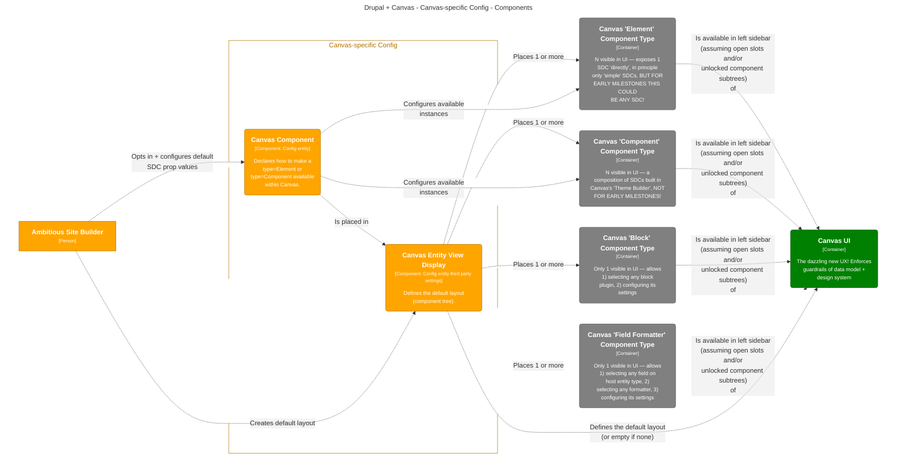

```mermaid
graph TB
  linkStyle default fill:#ffffff

  subgraph diagram ["Drupal + Canvas - Canvas-specific Config - Components"]
    style diagram fill:#ffffff,stroke:#ffffff

    1["<div style='font-weight: bold'>Ambitious Site Builder</div><div style='font-size: 70%; margin-top: 0px'>[Person]</div>"]
    style 1 fill:#ffa500,stroke:#b27300,color:#ffffff
    22("<div style='font-weight: bold'>Canvas 'Element' Component Type</div><div style='font-size: 70%; margin-top: 0px'>[Container]</div><div style='font-size: 80%; margin-top:10px'>N visible in UI — exposes 1<br />SDC 'directly', in principle<br />only 'simple' SDCs, BUT FOR<br />EARLY MILESTONES THIS COULD<br />BE ANY SDC!</div>")
    click 22 https://www.drupal.org/project/canvas/issues/3444417 "https://www.drupal.org/project/canvas/issues/3444417"
    style 22 fill:#808080,stroke:#595959,color:#ffffff
    26("<div style='font-weight: bold'>Canvas 'Component' Component Type</div><div style='font-size: 70%; margin-top: 0px'>[Container]</div><div style='font-size: 80%; margin-top:10px'>N visible in UI — a<br />composition of SDCs built in<br />Canvas's 'Theme Builder', NOT<br />FOR EARLY MILESTONES!</div>")
    click 26 https://www.drupal.org/project/canvas/issues/3444417 "https://www.drupal.org/project/canvas/issues/3444417"
    style 26 fill:#808080,stroke:#595959,color:#ffffff
    30("<div style='font-weight: bold'>Canvas 'Block' Component Type</div><div style='font-size: 70%; margin-top: 0px'>[Container]</div><div style='font-size: 80%; margin-top:10px'>Only 1 visible in UI — allows<br />1) selecting any block<br />plugin, 2) configuring its<br />settings</div>")
    click 30 https://www.drupal.org/project/canvas/issues/3444417 "https://www.drupal.org/project/canvas/issues/3444417"
    style 30 fill:#808080,stroke:#595959,color:#ffffff
    33("<div style='font-weight: bold'>Canvas 'Field Formatter' Component Type</div><div style='font-size: 70%; margin-top: 0px'>[Container]</div><div style='font-size: 80%; margin-top:10px'>Only 1 visible in UI — allows<br />1) selecting any field on<br />host entity type, 2)<br />selecting any formatter, 3)<br />configuring its settings</div>")
    click 33 https://www.drupal.org/project/canvas/issues/3444417 "https://www.drupal.org/project/canvas/issues/3444417"
    style 33 fill:#808080,stroke:#595959,color:#ffffff
    46("<div style='font-weight: bold'>Canvas UI</div><div style='font-size: 70%; margin-top: 0px'>[Container]</div><div style='font-size: 80%; margin-top:10px'>The dazzling new UX! Enforces<br />guardrails of data model +<br />design system</div>")
    click 46 https://www.drupal.org/project/canvas/issues/3454094 "https://www.drupal.org/project/canvas/issues/3454094"
    style 46 fill:#008000,stroke:#005900,color:#ffffff

    subgraph 14 ["Canvas-specific Config"]
      style 14 fill:#ffffff,stroke:#b27300,color:#b27300

      16("<div style='font-weight: bold'>Canvas Component</div><div style='font-size: 70%; margin-top: 0px'>[Component: Config entity]</div><div style='font-size: 80%; margin-top:10px'>Declares how to make a<br />type=Element or<br />type=Component available<br />within Canvas.</div>")
      style 16 fill:#ffa500,stroke:#b27300,color:#ffffff
      19("<div style='font-weight: bold'>Canvas Entity View Display</div><div style='font-size: 70%; margin-top: 0px'>[Component: Config entity third party settings]</div><div style='font-size: 80%; margin-top:10px'>Defines the default layout<br />(component tree).</div>")
      style 19 fill:#ffa500,stroke:#b27300,color:#ffffff
    end

    1-. "<div>Opts in + configures default<br />SDC prop values</div><div style='font-size: 70%'></div>" .->16
    16-. "<div>Is placed in</div><div style='font-size: 70%'></div>" .->19
    1-. "<div>Creates default layout</div><div style='font-size: 70%'></div>" .->19
    19-. "<div>Places 1 or more</div><div style='font-size: 70%'></div>" .->22
    16-. "<div>Configures available<br />instances</div><div style='font-size: 70%'></div>" .->22
    19-. "<div>Places 1 or more</div><div style='font-size: 70%'></div>" .->26
    16-. "<div>Configures available<br />instances</div><div style='font-size: 70%'></div>" .->26
    19-. "<div>Places 1 or more</div><div style='font-size: 70%'></div>" .->30
    19-. "<div>Places 1 or more</div><div style='font-size: 70%'></div>" .->33
    22-. "<div>Is available in left sidebar<br />(assuming open slots and/or<br />unlocked component subtrees)<br />of</div><div style='font-size: 70%'></div>" .->46
    26-. "<div>Is available in left sidebar<br />(assuming open slots and/or<br />unlocked component subtrees)<br />of</div><div style='font-size: 70%'></div>" .->46
    30-. "<div>Is available in left sidebar<br />(assuming open slots and/or<br />unlocked component subtrees)<br />of</div><div style='font-size: 70%'></div>" .->46
    33-. "<div>Is available in left sidebar<br />(assuming open slots and/or<br />unlocked component subtrees)<br />of</div><div style='font-size: 70%'></div>" .->46
    19-. "<div>Defines the default layout<br />(or empty if none)</div><div style='font-size: 70%'></div>" .->46
  end
```
