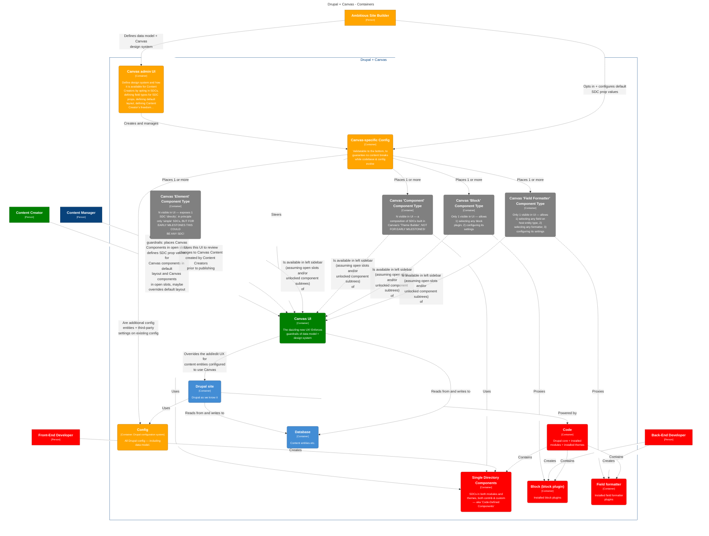

```mermaid
graph LR
  linkStyle default fill:#ffffff

  subgraph diagram ["Drupal + Canvas - Containers"]
    style diagram fill:#ffffff,stroke:#ffffff

    1["<div style='font-weight: bold'>Ambitious Site Builder</div><div style='font-size: 70%; margin-top: 0px'>[Person]</div>"]
    style 1 fill:#ffa500,stroke:#b27300,color:#ffffff
    2["<div style='font-weight: bold'>Content Creator</div><div style='font-size: 70%; margin-top: 0px'>[Person]</div>"]
    style 2 fill:#008000,stroke:#005900,color:#ffffff
    3["<div style='font-weight: bold'>Content Manager</div><div style='font-size: 70%; margin-top: 0px'>[Person]</div>"]
    style 3 fill:#08427b,stroke:#052e56,color:#ffffff
    4["<div style='font-weight: bold'>Front-End Developer</div><div style='font-size: 70%; margin-top: 0px'>[Person]</div>"]
    style 4 fill:#ff0000,stroke:#b20000,color:#ffffff
    5["<div style='font-weight: bold'>Back-End Developer</div><div style='font-size: 70%; margin-top: 0px'>[Person]</div>"]
    style 5 fill:#ff0000,stroke:#b20000,color:#ffffff

    subgraph 6 ["Drupal + Canvas"]
      style 6 fill:#ffffff,stroke:#0b4884,color:#0b4884

      12("<div style='font-weight: bold'>Canvas admin UI</div><div style='font-size: 70%; margin-top: 0px'>[Container]</div><div style='font-size: 80%; margin-top:10px'>Define design system and how<br />it is available for Content<br />Creators by opting in SDCs,<br />defining field types for SDC<br />props, defining default<br />layout, defining Content<br />Creator’s freedom…</div>")
      style 12 fill:#ffa500,stroke:#b27300,color:#ffffff
      14("<div style='font-weight: bold'>Canvas-specific Config</div><div style='font-size: 70%; margin-top: 0px'>[Container]</div><div style='font-size: 80%; margin-top:10px'>Validatable to the bottom, to<br />guarantee no content breaks<br />while codebase & config<br />evolve</div>")
      click 14 https://www.drupal.org/project/canvas/issues/3444424 "https://www.drupal.org/project/canvas/issues/3444424"
      style 14 fill:#ffa500,stroke:#b27300,color:#ffffff
      22("<div style='font-weight: bold'>Canvas 'Element' Component Type</div><div style='font-size: 70%; margin-top: 0px'>[Container]</div><div style='font-size: 80%; margin-top:10px'>N visible in UI — exposes 1<br />SDC 'directly', in principle<br />only 'simple' SDCs, BUT FOR<br />EARLY MILESTONES THIS COULD<br />BE ANY SDC!</div>")
      click 22 https://www.drupal.org/project/canvas/issues/3444417 "https://www.drupal.org/project/canvas/issues/3444417"
      style 22 fill:#808080,stroke:#595959,color:#ffffff
      26("<div style='font-weight: bold'>Canvas 'Component' Component Type</div><div style='font-size: 70%; margin-top: 0px'>[Container]</div><div style='font-size: 80%; margin-top:10px'>N visible in UI — a<br />composition of SDCs built in<br />Canvas's 'Theme Builder', NOT<br />FOR EARLY MILESTONES!</div>")
      click 26 https://www.drupal.org/project/canvas/issues/3444417 "https://www.drupal.org/project/canvas/issues/3444417"
      style 26 fill:#808080,stroke:#595959,color:#ffffff
      30("<div style='font-weight: bold'>Canvas 'Block' Component Type</div><div style='font-size: 70%; margin-top: 0px'>[Container]</div><div style='font-size: 80%; margin-top:10px'>Only 1 visible in UI — allows<br />1) selecting any block<br />plugin, 2) configuring its<br />settings</div>")
      click 30 https://www.drupal.org/project/canvas/issues/3444417 "https://www.drupal.org/project/canvas/issues/3444417"
      style 30 fill:#808080,stroke:#595959,color:#ffffff
      33("<div style='font-weight: bold'>Canvas 'Field Formatter' Component Type</div><div style='font-size: 70%; margin-top: 0px'>[Container]</div><div style='font-size: 80%; margin-top:10px'>Only 1 visible in UI — allows<br />1) selecting any field on<br />host entity type, 2)<br />selecting any formatter, 3)<br />configuring its settings</div>")
      click 33 https://www.drupal.org/project/canvas/issues/3444417 "https://www.drupal.org/project/canvas/issues/3444417"
      style 33 fill:#808080,stroke:#595959,color:#ffffff
      36("<div style='font-weight: bold'>Single Directory Components</div><div style='font-size: 70%; margin-top: 0px'>[Container]</div><div style='font-size: 80%; margin-top:10px'>SDCs in both modules and<br />themes, both contrib & custom<br />— aka 'Code-Defined<br />Components'</div>")
      style 36 fill:#ff0000,stroke:#b20000,color:#ffffff
      40("<div style='font-weight: bold'>Block (block plugin)</div><div style='font-size: 70%; margin-top: 0px'>[Container]</div><div style='font-size: 80%; margin-top:10px'>Installed block plugins</div>")
      style 40 fill:#ff0000,stroke:#b20000,color:#ffffff
      43("<div style='font-weight: bold'>Field formatter</div><div style='font-size: 70%; margin-top: 0px'>[Container]</div><div style='font-size: 80%; margin-top:10px'>Installed field formatter<br />plugins</div>")
      style 43 fill:#ff0000,stroke:#b20000,color:#ffffff
      46("<div style='font-weight: bold'>Canvas UI</div><div style='font-size: 70%; margin-top: 0px'>[Container]</div><div style='font-size: 80%; margin-top:10px'>The dazzling new UX! Enforces<br />guardrails of data model +<br />design system</div>")
      click 46 https://www.drupal.org/project/canvas/issues/3454094 "https://www.drupal.org/project/canvas/issues/3454094"
      style 46 fill:#008000,stroke:#005900,color:#ffffff
      55("<div style='font-weight: bold'>Config</div><div style='font-size: 70%; margin-top: 0px'>[Container: Drupal configuration system]</div><div style='font-size: 80%; margin-top:10px'>All Drupal config — including<br />data model.</div>")
      style 55 fill:#ffa500,stroke:#b27300,color:#ffffff
      57("<div style='font-weight: bold'>Code</div><div style='font-size: 70%; margin-top: 0px'>[Container]</div><div style='font-size: 80%; margin-top:10px'>Drupal core + installed<br />modules + installed themes</div>")
      style 57 fill:#ff0000,stroke:#b20000,color:#ffffff
      61("<div style='font-weight: bold'>Drupal site</div><div style='font-size: 70%; margin-top: 0px'>[Container]</div><div style='font-size: 80%; margin-top:10px'>Drupal as we know it</div>")
      style 61 fill:#438dd5,stroke:#2e6295,color:#ffffff
      65("<div style='font-weight: bold'>Database</div><div style='font-size: 70%; margin-top: 0px'>[Container]</div><div style='font-size: 80%; margin-top:10px'>Content entities etc.</div>")
      style 65 fill:#438dd5,stroke:#2e6295,color:#ffffff
    end

    1-. "<div>Defines data model + Canvas<br />design system</div><div style='font-size: 70%'></div>" .->12
    12-. "<div>Creates and manages</div><div style='font-size: 70%'></div>" .->14
    1-. "<div>Opts in + configures default<br />SDC prop values</div><div style='font-size: 70%'></div>" .->14
    14-. "<div>Places 1 or more</div><div style='font-size: 70%'></div>" .->22
    14-. "<div>Places 1 or more</div><div style='font-size: 70%'></div>" .->26
    14-. "<div>Places 1 or more</div><div style='font-size: 70%'></div>" .->30
    14-. "<div>Places 1 or more</div><div style='font-size: 70%'></div>" .->33
    22-. "<div>Uses</div><div style='font-size: 70%'></div>" .->36
    26-. "<div>Uses</div><div style='font-size: 70%'></div>" .->36
    4-. "<div>Creates</div><div style='font-size: 70%'></div>" .->36
    30-. "<div>Proxies</div><div style='font-size: 70%'></div>" .->40
    5-. "<div>Creates</div><div style='font-size: 70%'></div>" .->40
    33-. "<div>Proxies</div><div style='font-size: 70%'></div>" .->43
    5-. "<div>Creates</div><div style='font-size: 70%'></div>" .->43
    2-. "<div>Creates content within<br />guardrails: places Canvas<br />Components in open slots,<br />defines SDC prop values for<br />Canvas components in default<br />layout and Canvas components<br />in open slots, maybe<br />overrides default layout</div><div style='font-size: 70%'></div>" .->46
    3-. "<div>Uses this UI to review<br />changes to Canvas Content<br />created by Content Creators<br />prior to publishing</div><div style='font-size: 70%'></div>" .->46
    14-. "<div>Steers</div><div style='font-size: 70%'></div>" .->46
    22-. "<div>Is available in left sidebar<br />(assuming open slots and/or<br />unlocked component subtrees)<br />of</div><div style='font-size: 70%'></div>" .->46
    26-. "<div>Is available in left sidebar<br />(assuming open slots and/or<br />unlocked component subtrees)<br />of</div><div style='font-size: 70%'></div>" .->46
    30-. "<div>Is available in left sidebar<br />(assuming open slots and/or<br />unlocked component subtrees)<br />of</div><div style='font-size: 70%'></div>" .->46
    33-. "<div>Is available in left sidebar<br />(assuming open slots and/or<br />unlocked component subtrees)<br />of</div><div style='font-size: 70%'></div>" .->46
    14-. "<div>Are additional config<br />entities + third-party<br />settings on existing config</div><div style='font-size: 70%'></div>" .->55
    57-. "<div>Contains</div><div style='font-size: 70%'></div>" .->36
    57-. "<div>Contains</div><div style='font-size: 70%'></div>" .->40
    57-. "<div>Contains</div><div style='font-size: 70%'></div>" .->43
    46-. "<div>Overrides the add/edit UX for<br />content entities configured<br />to use Canvas</div><div style='font-size: 70%'></div>" .->61
    61-. "<div>Uses</div><div style='font-size: 70%'></div>" .->55
    61-. "<div>Powered by</div><div style='font-size: 70%'></div>" .->57
    61-. "<div>Reads from and writes to</div><div style='font-size: 70%'></div>" .->65
    46-. "<div>Reads from and writes to</div><div style='font-size: 70%'></div>" .->65
  end
```
