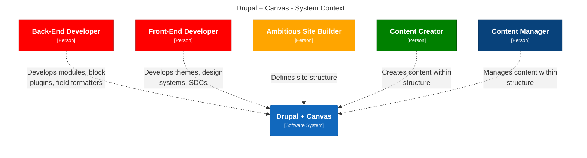

```mermaid
graph LR
  linkStyle default fill:#ffffff

  subgraph diagram ["Drupal + Canvas - System Context"]
    style diagram fill:#ffffff,stroke:#ffffff

    1["<div style='font-weight: bold'>Ambitious Site Builder</div><div style='font-size: 70%; margin-top: 0px'>[Person]</div>"]
    style 1 fill:#ffa500,stroke:#b27300,color:#ffffff
    2["<div style='font-weight: bold'>Content Creator</div><div style='font-size: 70%; margin-top: 0px'>[Person]</div>"]
    style 2 fill:#008000,stroke:#005900,color:#ffffff
    3["<div style='font-weight: bold'>Content Manager</div><div style='font-size: 70%; margin-top: 0px'>[Person]</div>"]
    style 3 fill:#08427b,stroke:#052e56,color:#ffffff
    4["<div style='font-weight: bold'>Front-End Developer</div><div style='font-size: 70%; margin-top: 0px'>[Person]</div>"]
    style 4 fill:#ff0000,stroke:#b20000,color:#ffffff
    5["<div style='font-weight: bold'>Back-End Developer</div><div style='font-size: 70%; margin-top: 0px'>[Person]</div>"]
    style 5 fill:#ff0000,stroke:#b20000,color:#ffffff
    6("<div style='font-weight: bold'>Drupal + Canvas</div><div style='font-size: 70%; margin-top: 0px'>[Software System]</div>")
    style 6 fill:#1168bd,stroke:#0b4884,color:#ffffff

    5-. "<div>Develops modules, block<br />plugins, field formatters</div><div style='font-size: 70%'></div>" .->6
    4-. "<div>Develops themes, design<br />systems, SDCs</div><div style='font-size: 70%'></div>" .->6
    1-. "<div>Defines site structure</div><div style='font-size: 70%'></div>" .->6
    2-. "<div>Creates content within<br />structure</div><div style='font-size: 70%'></div>" .->6
    3-. "<div>Manages content within<br />structure</div><div style='font-size: 70%'></div>" .->6
  end
```
