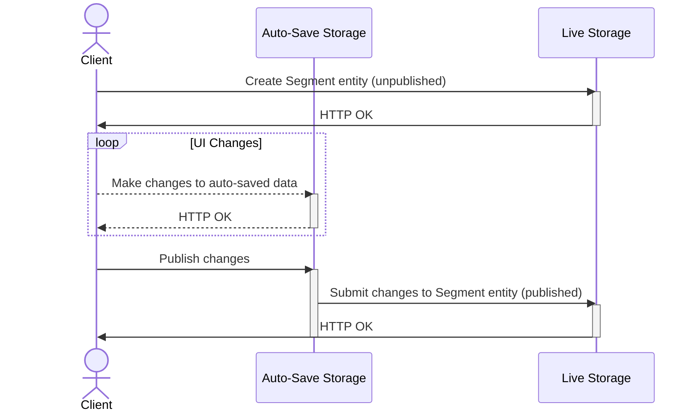

# Drupal Canvas Personalization

In the rest of this document, `Drupal Canvas` will be written as `Canvas`.

## 1. Terminology

`Personalization Segmentation Rule`: A condition that allows categorizing people into a group, or a context condition.
E.g. _“People who bought a bike last month”_, _“Visitors from the State of Colorado”_, _“Today is Sunday”_.

This powers market segmentation.

It might or not be deterministic (e.g. “_5% of visitors to this landing page_”)

`Personalization Segments (aka Segments)`: Group of segmentation rules that determine the target audience for doing
market segmentation. Sometimes might be referred to as `Audience` colloquially speaking, but we feel Segments is more
neutral e.g. when talking about temporary campaigns.

`Audience`: See above. The group of people who fit some characteristics defined by a group of segmentation rules.

`Campaign`: A personalization segment which is defined by a Segment Rule which might not  be based on market
segmentation, but on a temporary basis. E.g. “Christmas campaign”

`Personalization Variant` (term might change to `Variation`): A particular customization for a given Personalization
Segment.  Not to be confused with [SDC Variant](https://www.drupal.org/node/3517062).
When we talk about Personalization Variants, we talk about _both_:
- the explicit inputs for `component instance`s being different per variant. At the `component level`, this is what
Figma defines as Variant, Storybook might define it as Story, and at the SDC component level we
[might define it as Example](https://www.drupal.org/project/drupal/issues/3522644).
- the `component`s: it is possible not only to keep the same `component`s and just assign different
`explicit component input`s per variant, but also to completely change _which_ `component`s are present in a variant

`Default Personalization Variant`: The variant that will be displayed to the user when they don’t fit any of the
previous Segments. Colloquially speaking can be referred to as the `Default Site`.

`SDC Variant`: A glorified prop in SDC components called Variant. Not to be confused with Personalization Variant.
E.g. a SDC component named teaser with an image and some text might define “Image-Left” and “Image-Right” variants
that performs a visual change, but it’s semantically tied together enough for not having two different SDC components,
e.g. each of them differs on having a CSS class applied or not.

`A/B testing`: An experiment where two or more `Personalization Variants` are compared to see which one performs better
based on specific goals.

`Metrics`: Quantifiable measurements used to evaluate the success of different variations in an A/B test.

`Personalizable Component Tree`: At a very high level (excuse the simplification), we model the Canvas as a tree of
components. We might refer in this document to a Page from now on for simplicity, but we expect that Page Regions,
Content Templates or other trees might be personalizable.

`Grafting`: personalization variants of a subtree are grafts because they are _grafted_ onto (on top/over, really)
an existing subtree. See [Grafting on Wikipedia](https://en.wikipedia.org/wiki/Grafting)

## 2. Product requirements

This uses the terms defined above.

(There are more, and more will emerge, but these are the high level goals)

* MUST be possible for the Site Builder to define Segments for which they will provide a Personalization Variant.
* MUST be possible for the Site Builder to select different values for each Segment Rule. This will apply initially an OR
condition (e.g “_Location = Colorado OR Massachusetts_”, “_Hour = 9-12 OR 16-19_”), but might be customizable in the future.
* MUST be possible for the Site Builder to add multiple Segment Rules to each Segment. These are combined with an AND condition.
  (e.g. _“Location = Colorado OR Massachusetts AND Hour = 9-12 OR 16-19”_)
⚠️Should we consider this might be different in the future for allowing more complex rules?⚠️
* MUST be possible for the Site Builder to include a Segment rule defined in a third-party tool like Mautic.
* MUST NOT be possible for the Site Builder to add a Segment Rule to a Segment where an instance already exists.
E.g. If I added a Geographic rule, I cannot add another Geographic rule and should show disabled (grayed out).
* MUST be possible for the Site Builder to disable a Segment site-wide.
* MUST be possible for the Site Builder to disable a Personalization Variant for a given Personalization Component Tree.
* MUST be possible for the Site Builder to sort the Segments. They will be evaluated using this order, and the user
should see the Personalization Variant mapped to the matching segment. See 3.3. for details.
* MUST be possible for the Site Builder to preview a given Personalization Variant
* MUST be possible for the Site Builder to name a Personalization Variant on creation
* MUST be possible for the Site Builder to select a set of Segments after naming a Personalization Variant.
* MUST be possible for the Site Builder to add/modify/delete a `component instance` for a given Personalization Variant.
* We MIGHT rename/prefix the SDC Variant on the UI for avoiding confusions on terminology for Site Builders.
* We MIGHT want to reuse this infrastructure for a generalist “override” system, so when possible do not
be too specific.

## 3. Implementation / Architecture

We would like to have a feature flag for personalization. For simplicity, we will use a _canvas_personalization_ module for
that.

Currently, it's not that easy to generate extensions for the client UI. We will work directly on the React UI application.
For the backend, we will use the _canvas_personalization_ module as far (or as long) as possible.

### 3.1. Personalization Segments

#### 3.1.1. Server data-model

Segments will be a config entity.

Segments will use status for “publishing”. Any segment in auto-save will have ```status:false```.
If I edit a segment that is active, those modifications won't take effect until I manually publish them.

Segments that are not published are not used for negotiation.

Segments can be ordered, so they have a weight. The (site-wide) segment ordering determines which Variant
will be selected in a Personalization Variant: the first matching Segment is intersected with each Variant
in a personalized component subtree, then the second, etc., until a match is found. That Variant will be displayed.
Unless none match, then the Default Personalization Variant will be displayed.

Segments are site-wide.

A `default` `Segment` is provided, which acts as the fallback of the negotiation. This `default` `Segment` is protected
against edits or deletion.

###### Properties

id, label, description, rules (array), weight(int), status (bool)

The personalization rules will re-use the existing Condition API from Drupal core.

We need to take into consideration third-party integrations defining segment rules.
We might need in the future ensuring the last step for negotiation is done client-side. This means, more than one
grafting could be served for a given variation, and which one is actually active to the user could happen client-side.

###### Cacheability

Cacheability is composed by merging personalization rules cacheability.
Each rule has to provide their cacheability metadata. E.g. a **weather condition** might have a ```1h max-age```
while a **UTM condition** varies per cache context ```url.query_args:utm_source```.


#### 3.1.2. Client data-model

We will use the standardized auto-save + ```ApiConfigControllers``` end-points.
The UI should only need to deal with auto-save, as the ```ApiConfigController``` for publishing should be the same we
already have and publish all the changes at once.

The segment object looks like:

```json
{
  "id": "test",
  "label": "Test",
  "description": "Extended description",
  "status": true,
  "rules": {
    "utm_parameters": {
      "id": "utm_parameters",
      "negate": false,
      "all": true,
      "parameters": [
        {
          "key": "utm_source",
          "value": "my-source-id",
          "matching": "exact"
        },
        {
          "key": "utm_campaign",
          "value": "HALLOWEEN",
          "matching": "starts_with"
        }
      ]
    }
  }
}
```

The flow would be like:



So the flow will start with a POST to create the original entity.
This new segment will be disabled by default.

`POST /canvas/api/v0/config/segment`
```json
{
  "id": "my_first_segment",
  "label": "My first segment",
  "description": "Extended description"
}
```

We will do the changes on auto-save as needed. Here we can set the published flag as, this won't take effect until the user publishes the changes.

`PATCH /canvas/api/v0/config/auto-save/segment/my_first_segment`
```json
{
  "id": "my_first_segment",
  "label": "My first segment",
  "description": "Extended description",
  "status": true,
  "rules": {
    "utm_parameters": {
      "id": "utm_parameters",
      "negate": false,
      "all": true,
      "parameters": [
        {
          "key": "utm_source",
          "value": "my-source-id",
          "matching": "exact"
        }
      ]
    }
  }
}
```

When we are ready, the user will publish the changes.
We don't need to make this call, as the user will in the UI, but for reference:

`POST /canvas/api/v0/auto-saves/publish`


#### 3.1.3. Getting available segmentation rules

WIP

The segmentation rules are dynamic based on the installed modules. Those are defined by plugins (`condition`).

For the moment we can hard-code the expected segmentation rules, but these will be dynamic. See https://www.drupal.org/i/3525610.


### 3.2. Personalization Variations

Variants are local per grafting, on the contrary of segments that are global.

The provided `Personalization` component source defines two components: `switch` and `case`.

#### 3.2.1. Server data-model

Our `switch` component instance will define a grafting.
In its inputs, we store the different `cases` identifiers, in the `variants` input.

So the inputs for the `switch` component would look like

```yaml
switch inputs:
  variants:
    - variation-1
    - variation-2
    - variation-3
    - default
```

Those ids are arbitrary. They _don't_ relate to `Segment` IDs at all. We might actually use uuids when we build the client
for this.

The `switch` component instance slot contain the different `case` component instances that will define each grafting.
A `case` mapped to the `default` `Segment` is mandatory.

The mapping of `Segment` <=> Variants resides in the inputs of each grafting.
This mapping is 1-to-1 initially, but must include the option of having multiple `Segment`s per Variant in the future.

Then the inputs for the `case` component instance would look like

```yaml
case inputs:
  variant_id: 'variation-3' # This matches one of the `switch` `variants` above.
  segments: ['my-segment-id'] # This is the actual mapping variant <=> `Segment`s
```

Each `switch` or `case` could have a user-friendly label. This isn't in the `inputs` itself, but on the top-level
component instance label.

#### 3.2.2. Client data-model

TBD

See https://www.drupal.org/project/canvas/issues/3525746#comment-16121437
(this will define the -hopefully- generic switch-case `nodeType`s, or point to docs in `data-model.md 3.4.x` itself.)

### 3.3. Personalization Negotiation

Segments that are not published are not used for negotiation.

Segments sorting determine the priority on the negotiation.

A service should be able to load all the segments, and negotiate which one applies if any.

The logic would be:

1. Load all segments that are enabled and active sorted by weight ASC
2. For each of them, instantiate it and evaluate if there’s a match with current context.

>  ⚠️ We might have conditions that require client-side negotiation. If that's the case, we should ensure more than one
  segment can be active server-side, so the resolution terminates on the client. Otherwise, we would need to force
  a reload if cannot be determined in the first page-load.

3. Once we find one that matches, that’s our negotiated segment.

 >  ⚠️ Unless we have conditions that require client-side negotiation.

4. We can serve the personalization variant based on that segment, or the default if no matches were found.

If possible we should use the Context API.

# 4. Personalization recipe

We provide a recipe for seeing this in action that is used for tests, but can also be used for seeing a demo.

You can install it with something like

```
ddev drush site:install minimal --yes && ddev drush user:password admin admin && \
ddev -d /var/www/html/web exec php core/scripts/drupal recipe modules/contrib/canvas/tests/fixtures/recipes/test_site_personalization
```
