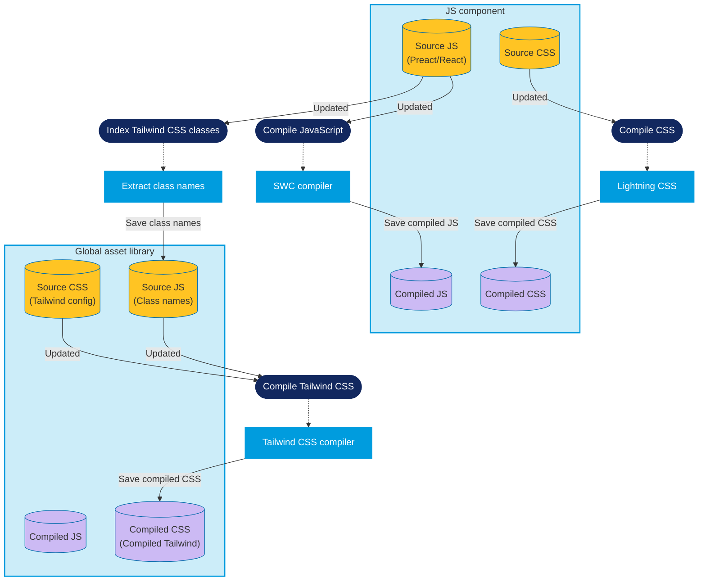

# Drupal Canvas in-browser code editor

```mermaid
flowchart TD
    subgraph jsComponent["JS component"]
        sourceJs[("Source JS<br>(Preact/React)")]
        sourceCss[("Source CSS")]
        compiledJs[("Compiled JS")]
        compiledCss[("Compiled CSS")]
    end
    
    subgraph globalAssetLibrary["Global asset library"]
        globalAssetSourceJs[("Source JS<br>(Class names)")]
        globalAssetSourceCss[("Source CSS<br>(Tailwind config)")]
        globalAssetCompiledJs[("Compiled JS")]
        globalAssetCompiledCss[("Compiled CSS<br>(Compiled Tailwind)")]
    end
    
    %% Flow 1: When Source JS of component is updated
    %% Tailwind CSS class name indexing
    sourceJs --> |"Updated"| indexTailwindCssClasses(["Index Tailwind CSS classes"])
    indexTailwindCssClasses -.-> extractClassNames["Extract class names"]
    extractClassNames --> |"Save class names"| globalAssetSourceJs
    %% JavaScript compilation
    sourceJs --> |"Updated"| compileJavaScript(["Compile JavaScript"])
    compileJavaScript -.-> swcCompiler["SWC compiler"]
    swcCompiler --> |"Save compiled JS"| compiledJs
    
    %% Flow 2: When Source CSS of component is updated
    sourceCss --> |"Updated"| compileCss(["Compile CSS"])
    compileCss -.-> lightningCss["Lightning CSS"]
    lightningCss --> |"Save compiled CSS"| compiledCss
    
    %% Flow 3: When Source CSS of global asset library changes
    globalAssetSourceCss --> |"Updated"| compileTailwindCss(["Compile Tailwind CSS"])
    globalAssetSourceJs --> |"Updated"| compileTailwindCss
    compileTailwindCss -.-> tailwindCssCompiler["Tailwind CSS compiler"]
    tailwindCssCompiler --> |"Save compiled CSS"| globalAssetCompiledCss
    
%% Style definitions
classDef entitySubgraph fill:#ccedf9,stroke:#009cde,stroke-width:2px
classDef sourceProperties fill:#ffc423,stroke:#006aa9,stroke-width:1px
classDef compiledProperties fill:#ccbaf4,stroke:#006aa9,stroke-width:1px
classDef mainProcesses fill:#12285f,stroke:#12285f,stroke-width:2px,color:#fff
classDef steps fill:#009cde,stroke:#009cde,stroke-width:1px,color:#fff

%% Apply styles
class jsComponent,globalAssetLibrary entitySubgraph
class sourceJs,sourceCss,globalAssetSourceJs,globalAssetSourceCss sourceProperties
class compiledJs,compiledCss,globalAssetCompiledJs,globalAssetCompiledCss compiledProperties
class indexTailwindCssClasses,compileJavaScript,compileCss,compileTailwindCss mainProcesses
class extractClassNames,swcCompiler,lightningCss,tailwindCssCompiler steps
```